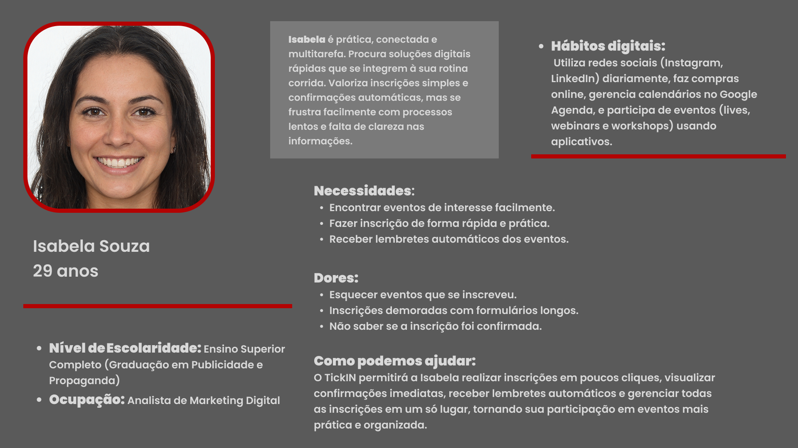

# Web Application Document - Projeto Individual - Módulo 2 - Inteli

## TickIN

#### [Mariana Lacerda Reis](https://www.linkedin.com/in/marianalacerdareis/)

## Sumário

1. [Introdução](#c1)  
2. [Visão Geral da Aplicação Web](#c2)  
3. [Projeto Técnico da Aplicação Web](#c3)  
4. [Desenvolvimento da Aplicação Web](#c4)  
5. [Referências](#c5)  

 

## 1. Introdução (Semana 01)

O projeto TickIN propõe o desenvolvimento de uma plataforma digital especializada no gerenciamento de eventos e no controle de inscrições de participantes. A proposta visa atender dois públicos principais: usuários interessados em participar de eventos, que buscam processos de inscrição ágeis, confirmações rápidas e acompanhamento das suas atividades, e organizadores de eventos, que necessitam de ferramentas práticas para criação, divulgação, gerenciamento de participantes e comunicação eficiente.

A plataforma oferecerá funcionalidades como a inscrição simplificada em poucos cliques, a visualização de eventos cadastrados, o gerenciamento de inscrições realizadas, o envio automatizado de lembretes próximos à data dos eventos, além de permitir que organizadores visualizem listas de inscritos, realizem controle de presença e comuniquem atualizações ou informações importantes aos participantes.

O TickIN será desenvolvido com foco na experiência do usuário (UX), priorizando interfaces intuitivas, processos desburocratizados e interação fluida. Será aplicado um modelo de desenvolvimento ágil, utilizando práticas de prototipação, validação contínua e ajustes iterativos com base no feedback dos usuários, a fim de maximizar a eficiência e a aderência da solução às necessidades reais do público-alvo.

Ao integrar as perspectivas tanto dos participantes quanto dos organizadores, o sistema visa otimizar o ecossistema de eventos, aumentando a satisfação dos usuários, a eficiência operacional dos organizadores e a qualidade geral das experiências proporcionadas.

---

## 2. Visão Geral da Aplicação Web

### 2.1. Personas (Semana 01)

Personas são arquétipos detalhados de usuários que capturam padrões de comportamento, motivações, objetivos e necessidades, criados a partir da análise de dados qualitativos e quantitativos, como entrevistas, observações e análises de mercado; ao traduzirem dados complexos em perfis humanos compreensíveis, facilitam a criação de produtos mais centrados no usuário, impactando diretamente a eficácia de projetos de design e tecnologia, sendo que, segundo a Interaction Design Foundation[¹](#5-referências), o uso de personas pode aumentar em até 18 % a taxa de adoção de novos produtos e melhorar a retenção de usuários em projetos digitais.

  FIGURA 1 - Persona 1 
   
  Fonte: Material produzido pela autora, 2025

  FIGURA 2 - Persona 2 
   
  Fonte: Material produzido pela autora, 2025

As personas desenvolvidas para o projeto TickIN representam dois perfis-chave de usuários: Isabela Souza, participante de eventos, e Rafael Silva, organizador de eventos. Isabela é uma profissional que valoriza processos de inscrição simples, confirmações automáticas e lembretes que facilitem sua gestão de tempo. Já Rafael é um coordenador de eventos analítico e focado em resultados, que busca ferramentas eficientes para criação de eventos, controle de inscrições e comunicação com os participantes. A aplicação TickIN foi projetada para atender diretamente às necessidades desses perfis, oferecendo uma plataforma intuitiva, ágil e organizada, que facilita tanto a experiência do participante quanto a gestão operacional do organizador.

### 2.2. User Stories (Semana 01)

User Stories são descrições curtas e informais de uma funcionalidade desejada, escritas do ponto de vista do usuário, que ajudam a capturar requisitos de forma colaborativa e incremental; geralmente seguem o formato "Como [tipo de usuário], quero [objetivo], para que [benefício]", permitindo que equipes de desenvolvimento mantenham o foco nas necessidades reais dos usuários. Para garantir a qualidade das User Stories, aplica-se o critério INVEST, que estabelece que cada história deve ser Independente, Negociável, Valiosa, Estimável, Pequena e Testável, princípios que, segundo Cohn (2004)[²](#5-referências), aumentam significativamente a eficácia da comunicação entre times de produto, desenvolvimento e stakeholders.

 
 #### US01 | Inscrição rápida
> Como participante interessado, quero me inscrever em eventos com poucos cliques, para que eu possa garantir minha vaga rapidamente sem complicações.

#### US02 | Gerenciamento de inscrições
> Como usuário inscrito, quero visualizar e gerenciar minhas inscrições em um painel, para que eu tenha controle sobre os eventos que participarei.

#### US03 | Visualizar lista de inscritos
> Como organizador de eventos, quero visualizar a lista de participantes inscritos, para que eu possa organizar o check-in e o controle de presença no evento.
>

  TABELA 1 - INVEST (US01) 

| Critério | Justificativa |
|:---|:---|
| **I – Independente** | A inscrição rápida é uma funcionalidade que não depende diretamente de outras (como lembretes ou painel de gerenciamento). |
| **N – Negociável** | Pode ser ajustada: por exemplo, decidir se a inscrição deve ter autenticação ou não, ou quantos campos serão exigidos. |
| **V – Valiosa** | Aumenta diretamente a satisfação do usuário ao oferecer uma experiência simples e ágil. |
| **E – Estimável** | Pode ser estimada em termos de esforço: integrar formulário simples, botão de confirmação, e banco de dados para armazenar a inscrição. |
| **S – Pequena** | A US é pequena e objetiva, podendo ser implementada em poucos dias de desenvolvimento. |
| **T – Testável** | Pode ser testada verificando se o usuário consegue se inscrever em poucos passos e se a inscrição é salva corretamente. |

  Fonte: Material produzido pela autora, 2025

## 3. Projeto da Aplicação Web

### 3.1. Modelagem do banco de dados  (Semana 3)
Modelagem de banco de dados é o processo de representar de maneira estruturada os dados e suas relações, com o objetivo de garantir organização, integridade e eficiência no armazenamento e recuperação de informações em sistemas computacionais. Essa prática permite que desenvolvedores e analistas visualizem como os dados se interconectam antes de implementá-los fisicamente, facilitando decisões técnicas e de negócio. A modelagem geralmente ocorre em três níveis: conceitual (representação abstrata com entidades e relacionamentos), lógico (ajuste ao modelo de dados do SGBD) e físico (estrutura real no banco). Segundo o Instituto de Ciências Matemáticas e de Computação da USP (ICMC-USP)[³](#5-referências), essa abordagem contribui para a construção de sistemas robustos e escaláveis, além de promover uma comunicação clara entre os stakeholders envolvidos no projeto.

  FIGURA 3 - Modelagem banco de dados 
   
  Fonte: Material produzido pela autora, 2025

[Clique aqui para acessar o schema do banco de dados no SQL](config/modelo-dados.sql)

A modelagem do banco de dados do sistema **TickIN** foi desenvolvida com o objetivo de garantir uma estrutura organizada, normalizada e escalável para o gerenciamento de eventos, inscrições, presenças, lembretes e usuários. A estrutura é composta por seis tabelas principais: `usuarios`, `eventos`, `inscricoes`, `presencas`, `lembretes` e `organizadores`.

A tabela `usuarios` armazena os dados essenciais dos participantes e organizadores, sendo identificados unicamente pelo CPF. Entre os atributos presentes, estão o nome, e-mail, telefone e o tipo de usuário (participante ou organizador), permitindo o controle de acesso e personalização das funcionalidades oferecidas pelo sistema.

A tabela `eventos` registra os eventos disponíveis no sistema. Cada evento possui um identificador único, um título, uma descrição, a data de realização e um campo que referencia o organizador responsável (relacionado à tabela `usuarios`). Essa associação caracteriza uma relação do tipo um-para-muitos (1:N), na qual um usuário organizador pode ser responsável por vários eventos.

A tabela `inscricoes` estabelece a relação entre usuários e eventos, indicando quais participantes estão inscritos em quais eventos. Cada inscrição referencia um usuário e um evento, formando assim uma estrutura que permite consultas como "eventos por usuário" ou "participantes por evento".

Para controle de participação, a tabela `presencas` está vinculada diretamente às inscrições. Ela registra se o participante compareceu ao evento, criando uma relação um-para-um (1:1) com a tabela `inscricoes`. Isso garante que cada inscrição possa ter, no máximo, um registro de presença vinculado.

A tabela `lembretes` complementa o sistema com a funcionalidade de comunicação automatizada. Ela armazena mensagens programadas para os inscritos em determinados eventos, promovendo maior engajamento. Cada lembrete está relacionado a um evento específico, configurando outra relação do tipo 1:N.

Por fim, a tabela `organizadores` é utilizada para vincular usuários responsáveis por eventos. Essa estrutura reforça a separação entre participantes e administradores, garantindo maior segurança e rastreabilidade no sistema.

Todas essas tabelas estão interligadas por meio de chaves primárias(PK) e estrangeiras(FK), garantindo integridade referencial e suporte a operações complexas de consulta, inserção e exclusão sem perda de consistência. As relações foram pensadas para permitir a expansão futura do sistema, como a adição de funcionalidades de notificação em tempo real, histórico de eventos ou múltiplos organizadores por evento.

### 3.1.1 BD e Models (Semana 5)
*Descreva aqui os Models implementados no sistema web*

### 3.2. Arquitetura (Semana 5)

*Posicione aqui o diagrama de arquitetura da sua solução de aplicação web. Atualize sempre que necessário.*

**Instruções para criação do diagrama de arquitetura**  
- **Model**: A camada que lida com a lógica de negócios e interage com o banco de dados.
- **View**: A camada responsável pela interface de usuário.
- **Controller**: A camada que recebe as requisições, processa as ações e atualiza o modelo e a visualização.
  
*Adicione as setas e explicações sobre como os dados fluem entre o Model, Controller e View.*

### 3.3. Wireframes (Semana 03)

Wireframe é uma representação visual simplificada da estrutura de uma interface, utilizada no processo de design para mapear a disposição e hierarquia dos elementos de navegação, entrada e saída de dados em uma aplicação digital. Essa técnica permite que equipes de desenvolvimento, design e stakeholders validem rapidamente a lógica de funcionamento do sistema antes da implementação gráfica ou técnica. Os wireframes podem variar em fidelidade, de esboços manuais até versões digitais mais detalhadas, e são fundamentais para garantir clareza, eficiência e alinhamento entre os envolvidos no projeto. Segundo a Interaction Design Foundation[⁴](#5-referências), wireframes funcionam como o “esqueleto” de uma interface, ajudando a identificar problemas de usabilidade ainda nas fases iniciais do desenvolvimento, o que reduz retrabalho e melhora a experiência do usuário final.

  FIGURA X - Wireframes do TickIN 
   
  Fonte: Material produzido pela autora, 2025

Esses wireframes representam o fluxo de navegação da aplicação Web TickIN, contemplando tanto a visão do participante quanto do organizador de eventos. O objetivo é estruturar de forma clara e funcional as principais interações da plataforma, com foco na inscrição, visualização de eventos, confirmação de presença e gestão de participantes.

As telas foram desenhadas em baixa fidelidade, sem elementos gráficos finais, priorizando a estrutura e posicionamento dos elementos da interface. A navegação foi planejada com base nas [User Stories](#22-user-stories-semana-01) 

#### Telas apresentadas e suas funcionalidades:

1. **Tela de Login**  
   Acesso ao sistema por e-mail e senha (presente em todos os fluxos).

2. **Listagem de eventos**  
   Exibição de eventos disponíveis com botão de inscrição rápida.  
   [US01](#us01--inscrição-rápida) – Inscrição rápida

3. **Detalhes do evento**  
   Visualização do organizador, informações e botão para inscrição.  
   [US01](#us01--inscrição-rápida)

4. **Minhas inscrições** (visão do participante)  
   Exibe eventos nos quais o usuário está inscrito, com opções para baixar ticket e confirmar presença.  
   [US02](#US02)  – Gerenciamento de inscrições

5. **Registrar evento** (visão do organizador)  
   Tela de cadastro de evento com campos essenciais e envio de imagens.  
   Etapa inicial da [US03](#us03--visualizar-lista-de-inscritos)

6. **Meus eventos**  
   Lista de eventos criados pelo organizador com opção de acessar participantes.  
   [US03](#us03--visualizar-lista-de-inscritos)

7. **Participantes inscritos**  
   Visualização dos nomes, status de confirmação e botões para contato direto com os inscritos.  
   [US03](#us03--visualizar-lista-de-inscritos) – Lista de participantes

[ Clique aqui para acessar os wireframes digitais no Figma](https://www.figma.com/design/QKcpPYIEc1QaPUepKMleID/Wireframe--tickIN?node-id=0-1&t=CWrtH7aFNK75SHtu-1)

### 3.4. Guia de estilos (Semana 05)

*Descreva aqui orientações gerais para o leitor sobre como utilizar os componentes do guia de estilos de sua solução.*

### 3.5. Protótipo de alta fidelidade (Semana 05)

*Posicione aqui algumas imagens demonstrativas de seu protótipo de alta fidelidade e o link para acesso ao protótipo completo (mantenha o link sempre público para visualização).*

### 3.6. WebAPI e endpoints (Semana 05)

*Utilize um link para outra página de documentação contendo a descrição completa de cada endpoint. Ou descreva aqui cada endpoint criado para seu sistema.*  

### 3.7 Interface e Navegação (Semana 07)

*Descreva e ilustre aqui o desenvolvimento do frontend do sistema web, explicando brevemente o que foi entregue em termos de código e sistema. Utilize prints de tela para ilustrar.*

---

## 4. Desenvolvimento da Aplicação Web (Semana 8)

### 4.1 Demonstração do Sistema Web (Semana 8)

*VIDEO: Insira o link do vídeo demonstrativo nesta seção*
*Descreva e ilustre aqui o desenvolvimento do sistema web completo, explicando brevemente o que foi entregue em termos de código e sistema. Utilize prints de tela para ilustrar.*

### 4.2 Conclusões e Trabalhos Futuros (Semana 8)

*Indique pontos fortes e pontos a melhorar de maneira geral.*
*Relacione também quaisquer outras ideias que você tenha para melhorias futuras.*

## 5. Referências

¹ INTERACTION DESIGN FOUNDATION. Personas – A Simple Introduction. [S.l.], 2022. Disponível em: https://www.interaction-design.org/literature/topics/personas. Acesso em: 25 abr. 2025.

² COHN, Mike. User Stories Applied: For Agile Software Development. Boston: Addison-Wesley, 2004.

³ UNIVERSIDADE DE SÃO PAULO. Instituto de Ciências Matemáticas e de Computação – Banco de Dados I. São Carlos: ICMC-USP, 2021. Disponível em: https://www.icmc.usp.br. Acesso em: 8 maio 2025.
 

⁴ INTERACTION DESIGN FOUNDATION. Wireframing: The Beginner’s Guide. 2023. Disponível em: https://www.interaction-design.org/literature/topics/wireframing. Acesso em: 13 maio 2025.

---
---
