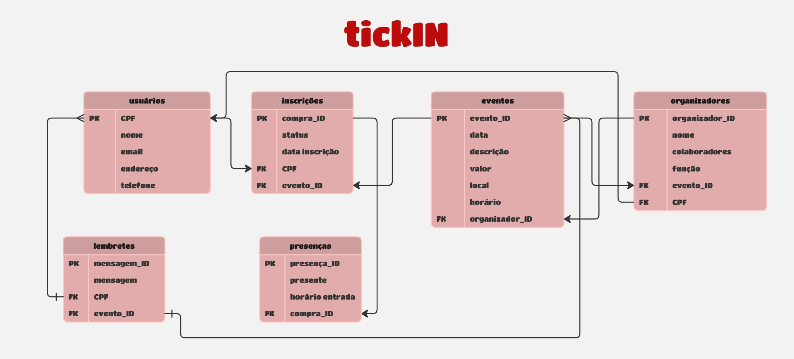

# tickIN
#### [Mariana Lacerda Reis](https://www.linkedin.com/in/marianalacerdareis/)
##  Descrição

Este projeto tem como objetivo o desenvolvimento de uma aplicação web para gestão de eventos, permitindo que usuários realizem inscrições, acompanhem informações dos eventos e tenham sua presença registrada de forma prática e automatizada. A plataforma oferece uma experiência simplificada para quem deseja participar de eventos e uma interface eficiente para quem os organiza.

Além de facilitar o controle de inscrições, a aplicação contribui para o gerenciamento inteligente da participação e da comunicação com os inscritos, por meio do envio de lembretes e registro de presença. Com isso, o sistema promove organização, economia de tempo e maior engajamento dos participantes.

Adicionalmente, a plataforma possibilita que organizadores associem eventos a seus dados, permitindo a identificação de responsáveis e colaborando para a rastreabilidade e transparência na gestão de cada atividade.

##  Modelo Relacional do Banco de Dados

A imagem abaixo representa a modelagem relacional utilizada na aplicação TickIN:




##  Arquitetura do Projeto (MVC)

Este projeto segue a arquitetura MVC (Model-View-Controller) com Node.js e Express.js, utilizando PostgreSQL como sistema gerenciador de banco de dados. A separação de responsabilidades entre as camadas facilita a manutenção e a escalabilidade da aplicação:
- Model: parte que armazena o modelo de negócios da aplicação;
- View: armazena a parte visual da aplicação;
- Controller: funciona como um intermediário entre Model e View.

O banco de dados é estruturado com base em um modelo relacional, que contempla entidades como `usuarios`, `eventos`, `inscricoes`, `organizadores`, entre outras.

## Requisitos

- Node.js (versão X.X.X) 
- PostgreSQL (versão X.X.X)

## Instalação

Caso você queira apenas acessar essa aplicação web basta clicar no link abaixo:

[Acessar aplicação](https://marianalreis.github.io/TickIN-PI/)

Se precisar clonar o projeto individualmente, você deve:
1. **Clonar o repositório:**

```bash
   git clone https://github.com/marianalreis/TickIN-PI.git
   cd seu-projeto
```

2. **Instalar as dependências:**
    
```bash
npm install
```
    
3. **Configurar o arquivo `.env`:**
    
Renomeie o arquivo `.env.example` para `.env` e configure as variáveis de ambiente necessárias, como as configurações do banco de dados PostgreSQL.
    

Configuração do Banco de Dados
-----------------------------

1. **Criar banco de dados:**
    
    Crie um banco de dados PostgreSQL com o nome especificado no seu arquivo `.env`.
    
2. **Executar o script SQL de inicialização:**
    
```bash
npm run init-db
```
    
Isso criará as tabelas definidas no schema SQL (`modelo-dados.sql`) conforme o modelo físico do banco de dados da aplicação, incluindo entidades como `usuários`, `eventos`, `inscricoes`, entre outras.

    


Estrutura de Diretórios
-----------------------
```
meu-projeto/
│
├── config/                # Arquivos de configuração (ex: conexão com banco)
│   └── database.js
├── controllers/           # Lógica de controle das requisições
│   └── HomeController.js
├── documents/             # Arquivos relacionados ao WAD(Web Design Document)
│   └── assets/            # Assets do WAD
│   └── PI-WAD.md         
├── models/                # Definição de modelos de dados (estrutura do banco)
│   └── User.js
├── routes/                # Definição das rotas do sistema
│   └── index.js
├── services/              # Serviços auxiliares do sistema
│   └── userService.js
├── assets/                # Arquivos públicos como imagens e fontes
├── scripts/               # Arquivos de JavaScript públicos
├── styles/                # Arquivos CSS públicos
├── views/                 #  Views da aplicação (se aplicável)
├── tests/                 # Arquivos de testes unitários
│   └── example.test.js
├── .gitignore             # Arquivo para ignorar arquivos no Git
├── .env.example           # Arquivo de exemplo para variáveis de ambiente
├── jest.config.js         # Arquivo de configuração do Jest
├── package-lock.json      # Gerenciador de dependências do Node.js
├── package.json           # Gerenciador de dependências do Node.js
├── README.md              # Documentação do projeto (Markdown)
├── rest.http              # Teste de endpoints (opcional)
└── server.js              # Arquivo principal que inicializa o servidor
```

Contribuição
------------

Contribuições são bem-vindas! Sinta-se à vontade para abrir um issue ou enviar um pull request.

Licença
-------

Este projeto está licenciado sob a Licença MIT.

Este README.md fornece uma visão geral clara do boilerplate, incluindo instruções de instalação, configuração do banco de dados, funcionalidades principais, scripts disponíveis, estrutura de diretórios, como contribuir e informações de licença. Certifique-se de personalizar as seções com detalhes específicos do seu projeto conforme necessário.
