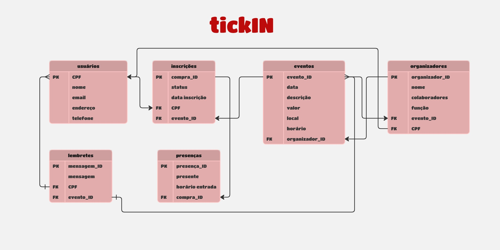

# tickIN
#### [Mariana Lacerda Reis](https://www.linkedin.com/in/marianalacerdareis/)
##  Descrição

Este projeto tem como objetivo o desenvolvimento de uma aplicação web para gestão de eventos, permitindo que usuários realizem inscrições, acompanhem informações dos eventos e tenham sua presença registrada de forma prática e automatizada. A plataforma oferece uma experiência simplificada para quem deseja participar de eventos e uma interface eficiente para quem os organiza.

Além de facilitar o controle de inscrições, a aplicação contribui para o gerenciamento inteligente da participação e da comunicação com os inscritos, por meio do envio de lembretes e registro de presença. Com isso, o sistema promove organização, economia de tempo e maior engajamento dos participantes.

Adicionalmente, a plataforma possibilita que organizadores associem eventos a seus dados, permitindo a identificação de responsáveis e colaborando para a rastreabilidade e transparência na gestão de cada atividade.

##  Modelo Relacional do Banco de Dados

A imagem abaixo representa a modelagem relacional utilizada na aplicação TickIN:




##  Arquitetura do Projeto (MVC)

Este projeto segue a arquitetura MVC (Model-View-Controller) com Node.js e Express.js, utilizando PostgreSQL como sistema gerenciador de banco de dados. A separação de responsabilidades entre as camadas facilita a manutenção e a escalabilidade da aplicação:
- Model: parte que armazena o modelo de negócios da aplicação;
- View: armazena a parte visual da aplicação;
- Controller: funciona como um intermediário entre Model e View.

O banco de dados é estruturado com base em um modelo relacional, que contempla entidades como `usuarios`, `eventos`, `inscricoes`, `organizadores`, entre outras.

## Requisitos

- Node.js (versão X.X.X) 
- PostgreSQL (versão X.X.X)

## Instalação

Caso você queira apenas acessar essa aplicação web basta clicar no link abaixo:

[Acessar aplicação](https://marianalreis.github.io/TickIN-PI/)

Se precisar clonar o projeto individualmente, você deve:
1. **Clonar o repositório:**

```bash
   git clone https://github.com/marianalreis/TickIN-PI.git
   cd seu-projeto
```

2. **Instalar as dependências:**
    
```bash
npm install
```
    
3. **Configurar o arquivo `.env`:**
    
Renomeie o arquivo `.env.example` para `.env` e configure as variáveis de ambiente necessárias, como as configurações do banco de dados PostgreSQL.


## Como Executar o Sistema

Após seguir os passos de instalação acima, execute o sistema localmente com os seguintes comandos:

1. **(Opcional) Inicialize o banco de dados:**
   Se for a primeira vez rodando, crie as tabelas executando:
   ```bash
   npm run init-db
   ```
   (ou rode manualmente o script SQL em `sql/` ou `database/` no seu PostgreSQL)

2. **Inicie o servidor:**
   ```bash
   npm start
   ```
   ou, para desenvolvimento com recarregamento automático:
   ```bash
   npm run dev
   ```

3. **Acesse a aplicação:**
   Abra o navegador e acesse:
   [http://localhost:3000](http://localhost:3000)

4. **Login e uso:**
   - Crie uma conta ou faça login.
   - Explore as funcionalidades de criação de eventos, inscrições e registro de presença.


Configuração do Banco de Dados
-----------------------------

1. **Criar banco de dados:**
    
    Crie um banco de dados PostgreSQL com o nome especificado no seu arquivo `.env`.
    
2. **Executar o script SQL de inicialização:**
    
```bash
npm run init-db
```
    
Isso criará as tabelas definidas no schema SQL (`modelo-dados.sql`) conforme o modelo físico do banco de dados da aplicação, incluindo entidades como `usuários`, `eventos`, `inscricoes`, entre outras.

Estrutura de Diretórios
-----------------------
```
TickIN-PI/
│
├── assets/                # Imagens e arquivos públicos
├── config/                # Configurações do banco e ambiente
│   └── database.js
├── controllers/           # Lógica de controle das requisições
├── css/                   # Arquivos CSS do sistema
├── database/              # Scripts e arquivos auxiliares do banco
├── middleware/            # Middlewares de autenticação e outros
├── models/                # Modelos de dados (estrutura do banco)
├── node_modules/          # Dependências do Node.js
├── routes/                # Definição das rotas do sistema
├── scripts/               # Scripts utilitários e de inicialização
├── services/              # Serviços auxiliares do sistema
├── sql/                   # Scripts SQL para estrutura e migração
├── views/                 # Views EJS da aplicação
│   └── pages/             # Páginas principais
│   └── partials/          # Partes reutilizáveis (header, footer, etc)
├── .gitignore             # Arquivo para ignorar arquivos no Git
├── Comp_Ponderada3.md     # Documentação complementar
├── Comp_Ponderada4.md     # Documentação complementar
├── database.sql           # Script SQL principal
├── fix_eventos.sql        # Script de correção de eventos
├── index.html             # Página inicial estática (opcional)
├── instrução.md           # Instruções do projeto
├── migration.sql          # Script de migração do banco
├── package.json           # Gerenciador de dependências do Node.js
├── package-lock.json      # Lockfile do Node.js
├── PI-WAD.md              # Documento WAD do projeto
├── README.md              # Documentação do projeto
├── recreate_eventos.sql   # Script de recriação de eventos
├── rest.http              # Teste de endpoints (opcional)
├── server.js              # Arquivo principal que inicializa o servidor
├── verify_structure.sql   # Script de verificação de estrutura
└── ... (outros arquivos e pastas)
```

```

Contribuição
------------

Contribuições são bem-vindas! Sinta-se à vontade para abrir um issue ou enviar um pull request.

Licença
-------

Este projeto está licenciado sob a Licença MIT.

Este README.md fornece uma visão geral clara do boilerplate, incluindo instruções de instalação, configuração do banco de dados, funcionalidades principais, scripts disponíveis, estrutura de diretórios, como contribuir e informações de licença. Certifique-se de personalizar as seções com detalhes específicos do seu projeto conforme necessário.
